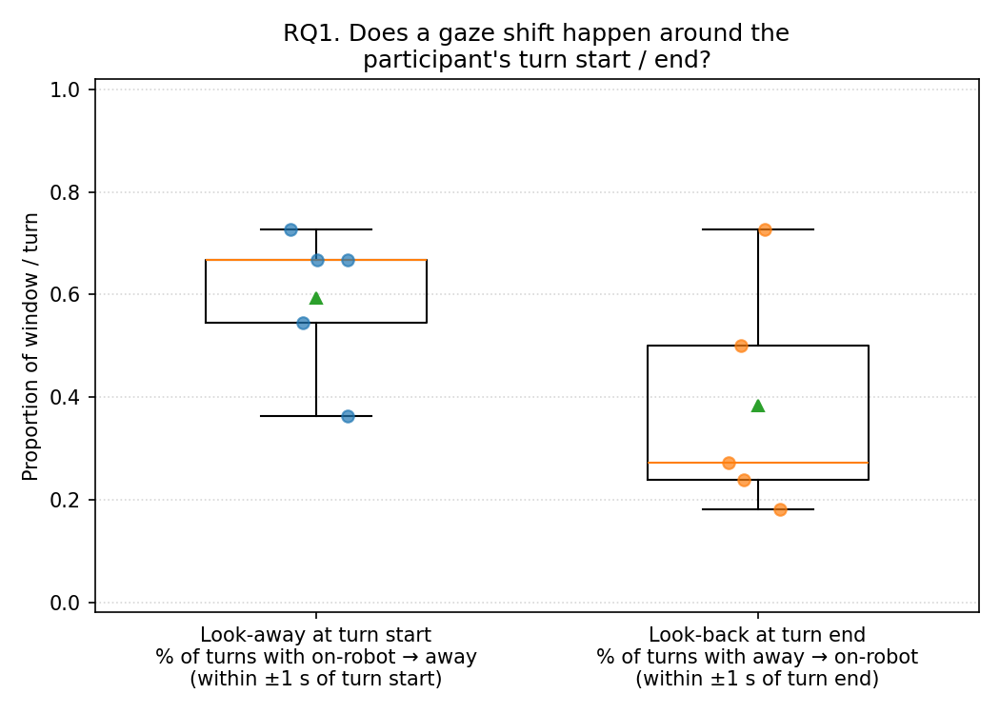
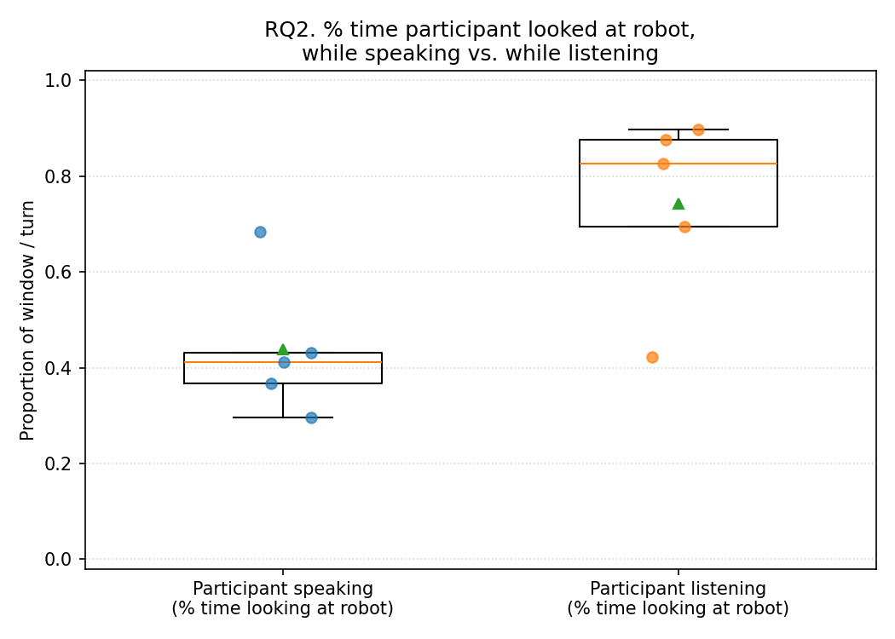
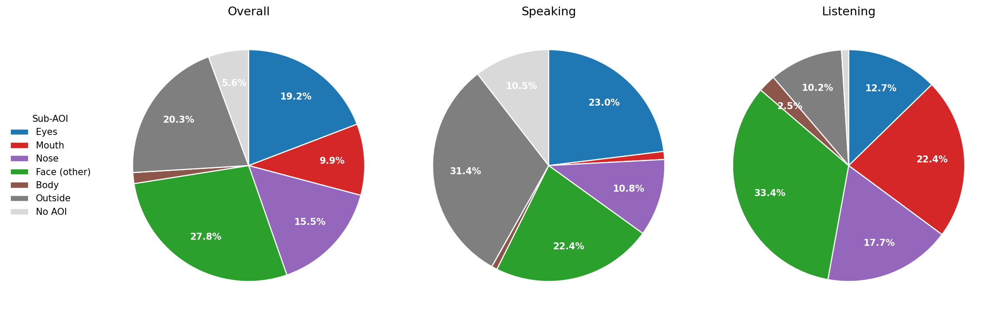
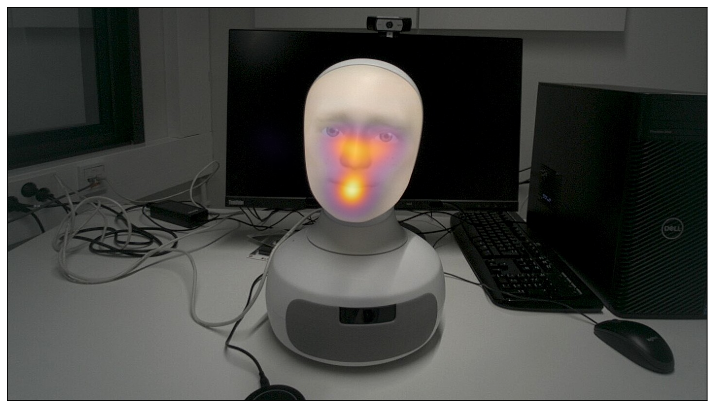
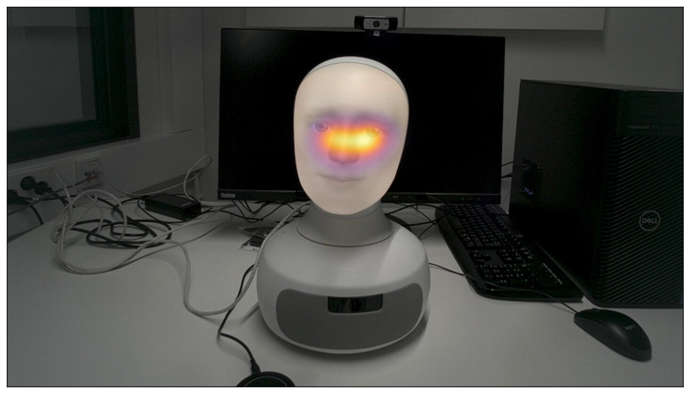
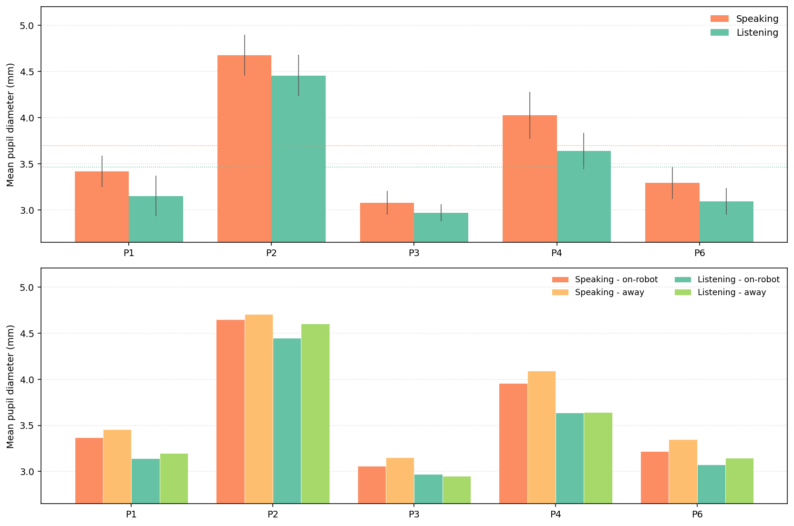

# Human Gaze During Conversational Interaction With a Robot

<p align="center">
  
  
</p>

## Overview
This repository contains the data, analysis scripts, and write-up for a study on human gaze during conversation with the Furhat humanoid robot. The primary goal is to test whether two well-established gaze patterns from human-to-human conversation still hold when the conversation partner is a humanoid robot:

* **RQ1, Turn-taking regulation.** (a) How often do participants look away from the robot at turn start? (b) How often do they look back at the robot at turn end?
* **RQ2, Listening vs Speaking.** (a) What percentage of time is spent looking at the robot in each role? (b) Do participants look at the robot more while listening than while speaking?

## Dataset
* Five participants (N = 5) completed a ten-minute conversation with the Furhat robot.
* Gaze was recorded with Tobii Pro Glasses 3, a head-mounted eye tracker sampling at approximately 50 Hz.
* The robot was driven by a custom Furhat skill with a Gemini LLM backend ([dara-nn/Furhat-eye-tracking](https://github.com/dara-nn/Furhat-eye-tracking)).
* Gaze samples are tagged with one of six Areas of Interest (Face, Eyes, Mouth, Nose, Body, Outside) and collapsed into a binary *on-robot* / *away* label.

## Methodology Pipeline
1. **Pre-processing.** Map each gaze sample from the eye-tracker recording onto the scene-camera snapshot, hit-test against the drawn AOIs, and collapse the six AOIs into the aggregated *on-robot* / *away* variable.
2. **Turn events.** Extract turn-start and turn-end timestamps from the anonymized transcript and merge them into the gaze file.
3. **RQ1, look-away / look-back.** For each turn, scan a ±1 s window around turn start (look-away) and turn end (look-back) using an event-detection rule based on consecutive same-label samples, with sub-200 ms runs dropped as noise.
4. **RQ2, role asymmetry.** Compute the percentage of valid samples spent on-robot during the *listening* and *speaking* roles, per participant.
5. **Random-window baseline.** Re-run the RQ1 detector on 100 randomly placed two-second windows per participant to verify the turn-anchored numbers are not chance-level.
6. **Sub-AOI dwell.** Within on-robot samples, break down dwell time across the Face sub-AOIs (Eyes, Mouth, Nose) and the Body AOI.
7. **Pupil arousal.** Compare mean pupil diameter during speaking versus listening, on-robot versus away.

## Results

**RQ1(a), look-away at turn start.** A look-away occurred in 59.4% (14.5%) of turns, 22.2 pp above the random-window rate of 37.2%.

**RQ1(b), look-back at turn end.** A look-back occurred in 38.4% (22.7%) of turns, indistinguishable from the random-window rate of 40.0%. The pattern did not appear.

<p align="center"></p>

**RQ2, Listening vs Speaking.** On-robot time was 74.3% (19.6%) while listening and 43.8% (14.7%) while speaking, a 30.5 pp gap. Listening exceeded speaking for every participant.

<p align="center"></p>

**Sub-AOI fixation.** While listening, participants fixated the robot's mouth. While speaking, gaze moved up to the eyes.

<p align="center"></p>

<p align="center">
  
  
</p>

**Pupil arousal.** Pupil diameter was larger during participant speech than during listening, possibly reflecting cognitive effort during speech planning.

<p align="center"></p>

## Project Structure

```text
data/
├── gaze-data-trimmed/           # Per-participant Tobii TSVs (analysis columns only)
├── transcript-timestamp-data/   # Raw ElevenLabs transcripts with word-level timestamps
├── transcripts-anonymized/      # Anonymized, turn-aligned transcripts
├── from-glass-data/snap.jpg     # Scene-camera snapshot used to draw the AOIs
└── turn_events.csv              # Turn-start and turn-end timestamps

scripts/
├── step1_preprocess.py          # AOI hit-test, aggregated AOI, turn merge
├── step2_rq1_turn_taking.py     # RQ1 look-away / look-back detector
├── step3_rq3_role_asymmetry.py  # RQ2 listening vs speaking
├── step4_aggregate_and_plot.py  # Per-participant CSV and box plots
├── run_main_rqs.py              # Orchestrator for steps 1–4
├── baseline_random_2s.py        # Random-window baseline for RQ1
├── subaoi_dwell.py              # Sub-AOI dwell percentages
├── subaoi_dwell_pies.py         # Sub-AOI pie charts
├── pupil_arousal.py             # Pupil diameter by role and gaze
├── heatmap.py                   # Fixation heatmaps
└── turn_timeline.py             # Turn-event timeline figure

figures/                          # Generated plots and setup photos
appendices/convo-example.mp4      # Example clip from one session
```

## Full Report
For the full write-up, please refer to [research-report.pdf](research-report.pdf).
